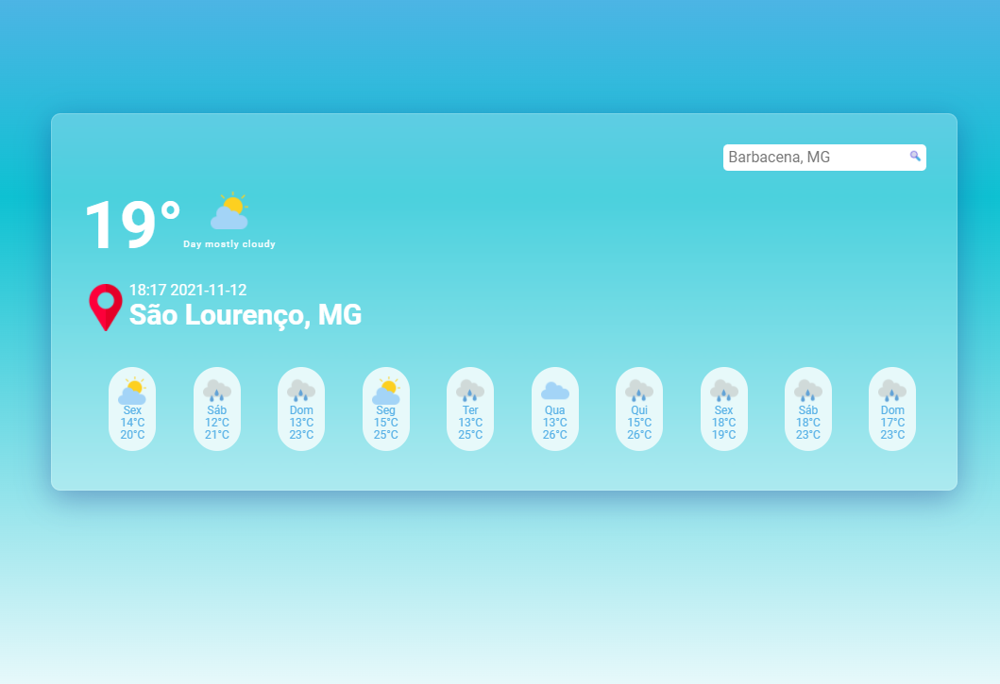

# ClimaTempo - Site de Previsão do Tempo

Site ClimaTempo foi desenvolvido para o usuário poder consultar de forma rápida e intuitiva a previsão do tempo local.

# Objetivos
    - [X] Mobile-First
    - [X] Single Page Application
    - [X] Informar a previsão do tempo do dia atual.
    - [X] Usuário poderá selecionar qual cidade ele estará querendo consultar a previsão
    - [X] Responsividade
    - [X] Layout UI/UX 

# Correções
    - [] Repetindo as imagens correspondentes a informação do dia.
    - [] Verificar background

# Imagens do Projeto

# Créditos
    - Ícones: 
    https://www.flaticon.com/authors/iconixar